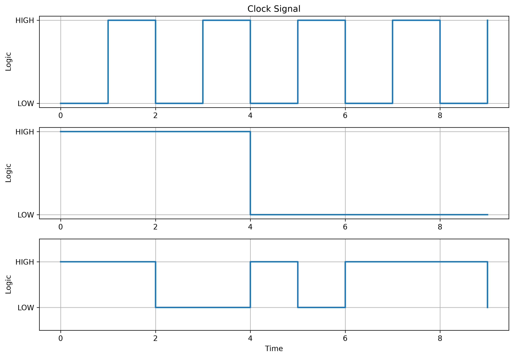
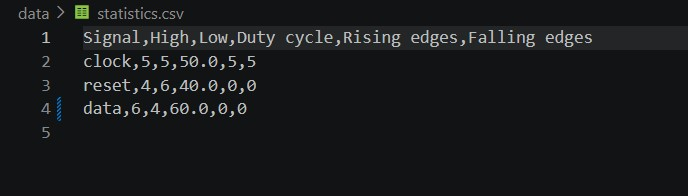
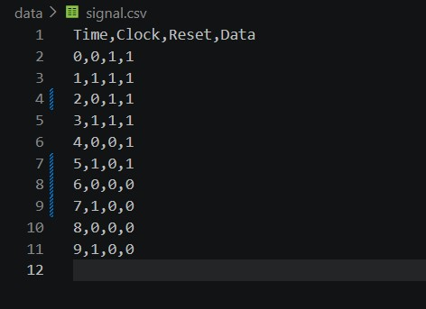
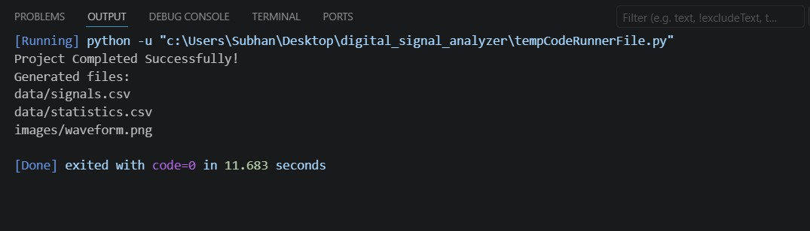

# DIGITAL SIGNAL ANALYZER
A VLSI-oriented "Digital Signal Analyzer" project built using Python, NumPy, Pandas and Matplotlib. 

The Digital Signal Analyzer generates digital signals, analyzes their properties and then plots the clock, reset, and data waveforms in the form of graphs.

## Features
- Generates clock signal
- Generates reset signal
- Generates data signal
- Analyze HIGH and LOW counts
- Calculate duty cycle
- Detect rising and falling edges 
- Plots digital waveforms
- Export signal data to CSV
- Export signal statistics to CSV
- Save waveform as PNG image

## Technologies Used
- Python
- NumPy
- Pandas
- Matplotlib

## Project Structure

```text
Digital_Signal_Analyzer/
│
├── main.py
├── signal_generator.py
├── analyzer.py
├── plotter.py
│
├── data/
│   ├── signal.csv
│   └── statistics.csv
│
├── images/
│   └── waveform.png
│
├── README.md
├── requirements.txt
└── .gitignore
```

## How it works

### Step.1 Generate digital signals
- Clock
- Reset
- Data

### Step.2 Visualize all signals using Matplotlib

### Step.3 Analyze each signal
- HIGH count
- LOW count
- Duty cycle
- Rising edges
- Falling edges

### Step.4 Export results
- signal.csv
- statistics.csv
- waveform.png

## Sample Output

### Signal Statistics

```text
+--------+------+-----+------------+--------------+---------------+
| Signal | HIGH | LOW | Duty Cycle | Rising Edges | Falling Edges |
+--------+------+-----+------------+--------------+---------------+
| Clock  |  5   |  5  |    50%     |      5       |       4       |
| Reset  |  4   |  6  |    40%     |      0       |       1       |
|  Data  |  6   |  4  |    60%     |      3       |       2       |
+--------+------+-----+------------+--------------+---------------+
```

## Project Screenshots 

### Waveform 



### Statistics CSV



### Signal CSV



### Terminal Output



## Installation

1. Clone or download the project.

2. Open the project  folder in VS Code

3. Install the required libraries:

```bash
pip install -r requirements.txt
```

4. Run the project:

```bash
python main.py
```

## Generated Files

Running `python main.py` automatically creates the following files:

``` 
data/
|---signal.csv
|---statistics.csv

images/
|---waveform.png
```

## Skills Demonstrated
- Python Programming
- Numpy Array Operations
- Pandas Data Processing
- Matplotlib Visualization
- CSV File Handling
- Digital Signal Generation
- Digital Signal Analysis
- Modular Programming

## Author

**Basit Ali**

Electronics and Communication Engineering Student

Interested in:
- VLSI Design
- Digital Design
- Embedded Systems
- Python for Hardware Applications

Github: [Basit Ali](https://github.com/basit-ali-22)
